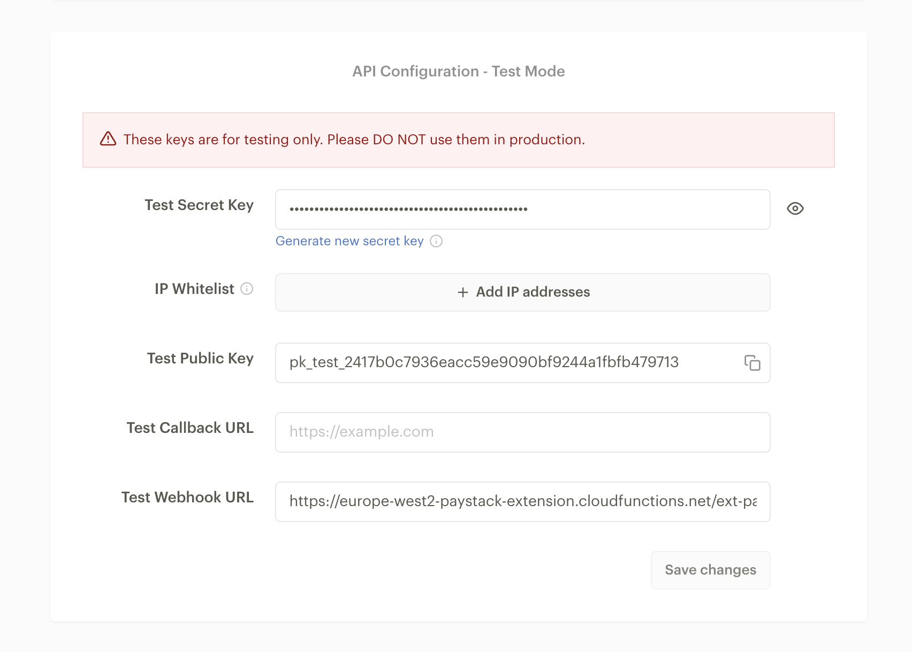
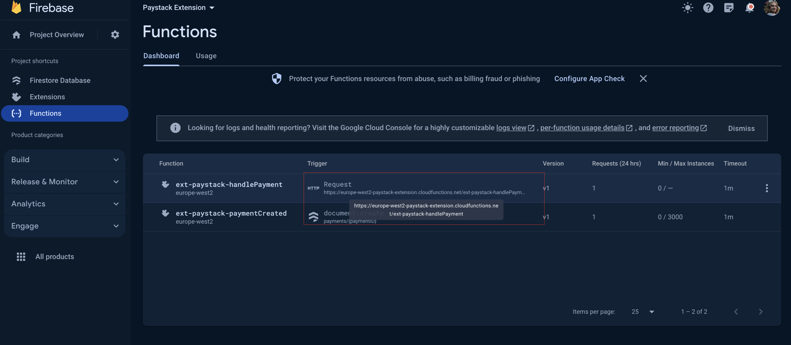

# Fire Paystack

This repo contains the implementation for the Paystack Firebase Extension

## How to use this extension

Use this extension to process payments in Africa with [Paystack](https://paystack.com) based on the information contained in a document added to a specific Firestore collection.

Adding a document triggers this extension to [initialise a payment](https://paystack.com/docs/api/transaction/#initialize) with Paystack, and writes an `authorization_url back` to the document. This `authroization_url` can then be used to direct a user to the payment screen hosted by Paystack. The document’s top-level fields specify the email of the purchaser and the amount of the payment. Currently, payments are only supported in ZAR, but expanded support for multiple currencies is planned for the future.

Here’s a basic example document write that would trigger this extension to initialize a payment of R100 for `someone@example.com`:

```js
admin.firestore().collection('payments').add({
  email: 'someone@example.com',
  amount: 100,
})
```

This would then populate the document with some additional fields, in particular the `authorization_url` which is the payment page hosted by paystack. After successful payment, the extension has an HTTPS triggered Cloud Function which is called by Paystack to alert us of the success. This will then set the `status` field of the payment document to "successful".

## Setup with Paystack

When you configure this extension, you’ll need to supply your Paystack API key for the extension to interact with Paystack. This can be found on your Paystack Dashboard under [Settings > API Keys and Webhooks](https://dashboard.paystack.com/#/settings/developers).

In this same section of the settings, you will provide the webhook URL corresponding to the Cloud Function that has been created by the extension. Make sure to provide the URL corresponding to a devlopment project in the "Test Webhook URL" and the URL corresponding to a production project in the "Live Webhook URL."

See below the section to access the Test API key and setting of the webhook URL"


The webhook URL can be found by navigating to the Cloud Functions section of your Firebase project in which the extension is installed:


<!-- We recommend keeping the following section to explain how billing for Firebase Extensions works -->
## Billing

To install an extension, your project must be on the Blaze (pay as you go) plan

This extension uses other Firebase and Google Cloud Platform services, which have associated charges if you exceed the service’s no-cost tier:

- Secrets Manager
- Cloud Functions
- Cloud Firestore

When you use Firebase Extensions, you're only charged for the underlying resources that you use. All Firebase services offer a free tier of usage. [Learn more about Firebase billing.](https://firebase.google.com/pricing). Furthermore, the [transaction fees](https://paystack.com/za/pricing) as charged by Pastack are applied to all payments processed.
